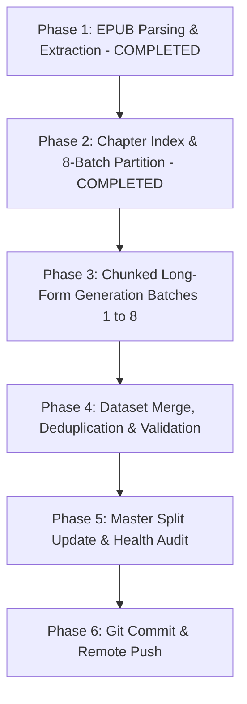

# Implementation Plan: Processing 'The Collected Teachings of Ajahn Chah (Single Volume)'

This document outlines the systematic, end-to-end plan to process the single-volume master compendium ***The Collected Teachings of Ajahn Chah*** into an exhaustive, high-depth Chat SFT training dataset for fine-tuning LLMs in the Thai Forest Tradition lineage of Luang Por Chah.

---

## 1. Scope & Source Details

- **Source File**: `documents/raw_epubs/The-Collected-Teachings-of-Ajahn-Chah-Single-Volume-Ajahn-Chah.epub`
- **Extracted Source Directory**: `documents/extracted/The Collected Teachings of Ajahn Chah - Single Volume - Ajahn Chah/`
- **Total Substantive Content**: 57 substantive Dhamma talks spanning 279,034 words.
- **Target Output Dataset**: `datasets/The_Collected_Teachings_of_Ajahn_Chah_qa.jsonl`
- **Target Volume**: **250–350 rich QA pairs** spanning all substantive talks.
- **Answer Profile**: **Extended long-form teachings (250–450 words per answer)** strictly implementing the 4-part Thai Forest pedagogical framework (Empathetic Acknowledgment, Direct Observation, Precise Pāli glosses, Lineage Similes).

---

## 2. Core Execution Phases

### Phase 1: EPUB Parsing & Extraction *(Completed)*
- Extracted 62 chapter files (279,034 words), `full_book.txt`, and `metadata.json` to:
  `documents/extracted/The Collected Teachings of Ajahn Chah - Single Volume - Ajahn Chah/`.

### Phase 2: 8-Batch Partition Structure *(Completed)*
The 57 substantive talks are organized into 8 balanced generation batches:
- **Batch 1 (Talks 5–11, 26,372 words)**: *The Middle Way Within, The Peace Beyond, Convention And Liberation, No Abiding, Evening Sitting, About Being Careful, Understanding Dukkha* (~35 QA pairs).
- **Batch 2 (Talks 12–18, 29,818 words)**: *The Dhamma Goes Westward, Even One Word Is Enough, Making The Heart Good, Why Are We Here?, Our Real Home, The Four Noble Truths, Living In The World* (~35 QA pairs).
- **Batch 3 (Talks 19–25, 25,061 words)**: *Tuccho Pothila, Transcendence, Timeless Teachings, Fragments of a Teaching, A Gift of Dhamma, Living with the Cobra, Reading the Natural Mind* (~35 QA pairs).
- **Batch 4 (Talks 26–33, 24,186 words)**: *Just Do It!, Questions and Answers, Steady Practice, Detachment Within Activity, Tranquillity and Insight, The Path in Harmony, The Place of Coolness* (~35 QA pairs).
- **Batch 5 (Talks 34–40, 37,435 words)**: *Monastery of Confusion, Knowing the World, Supports for Meditation, Still, Flowing Water, Toward the Unconditioned, Clarity of Insight, Learning to Listen* (~40 QA pairs).
- **Batch 6 (Talks 41–47, 35,362 words)**: *Unshakeable Peace, Just This Much, What is Contemplation?, Dhamma Nature, Two Faces of Reality, The Training of the Heart, The Wave Ends* (~40 QA pairs).
- **Batch 7 (Talks 48–54, 32,908 words)**: *Dhamma Fighting, Understanding Vinaya, Maintaining the Standard, The Flood of Sensuality, In The Dead Of Night ..., The Fountain of Wisdom, Not Sure* (~40 QA pairs).
- **Batch 8 (Talks 55–62, 59,405 words)**: *Wholehearted Training, Right Restraint, Suffering on the Road, Opening the Dhamma Eye, The Path to Peace, Toilets on the Path, A Message From Thailand, It Can Be Done* (~40 QA pairs).

### Phase 3: Chunked Generation & Verification
- Generate extended long-form QA pairs (250–450 words) batch by batch.
- Intermediate batches stored and merged into `datasets/The_Collected_Teachings_of_Ajahn_Chah_qa.jsonl`.
- Verify each batch using `verify_dataset.py`.

### Phase 4: Master Splits & Health Audit
- Update `corpus_summary.py` mapping for the single-volume dataset.
- Re-run `merge_and_split_dataset.py --val-ratio 0.1` to update `master_dhamma_qa.jsonl`, `train.jsonl`, and `val.jsonl`.
- Regenerate format exports (`train_sharegpt.json`, `val_sharegpt.json`).
- Run `corpus_summary.py` to confirm all 14 corpus sources are `[HEALTHY]`.

### Phase 5: Git Submission
- Stage, commit, and push all datasets, extracted texts, and split files to GitHub.

---

## 3. Acceptance Criteria
- [ ] 250–350 high-depth QA pairs covering all 57 substantive talks.
- [ ] Average assistant answer length: 250–450 words.
- [ ] `verify_dataset.py` passes with 0 errors.
- [ ] Working tree clean, committed, and pushed to remote `main`.
