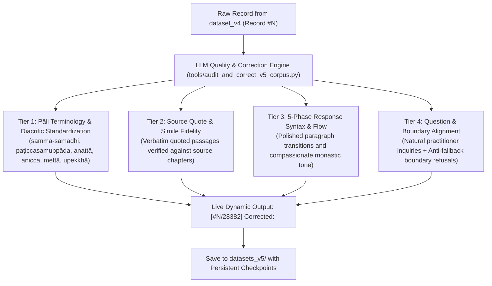

# Dhamma AI Training Corpus & Pipeline

A specialized, comprehensive, multi-generation machine learning dataset and extraction pipeline for fine-tuning Large Language Models in the authentic lineage of the **Thai Forest Tradition** (Luang Por Chah, Ajahn Sumedho, Ajahn Pasanno, Ajahn Amaro, Ven. Bhikkhu Kaṭukurunde Ñāṇananda, Ajahn Sucitto, Ajahn Jayasāro, Ajahn Thiradhammo, Ajahn Sundara, Ajahn Candasiri, and Luang Por Liem Ṭhitadhammo).

---

## 1. Corpus Generations & Master Statistics

The repository maintains five isolated, validated generations of the dataset:

| Generation | Master Split Path | Record Count (Train / Val) | Avg Answer Length | Focus & Alignment | Status |
|---|---|---|---|---|---|
| **Dataset-V1** | `datasets/splits/master_dhamma_qa.jsonl` | **14,225 records** (12,803 / 1,422) | ~115 words | Single-sentence concise prompts | Baseline (100% Intact) |
| **Dataset-V2** | `datasets_v2/splits/master_25k_dhamma_qa.jsonl.gz` | **28,381 records** (25,543 / 2,838) | ~564 words | Long-form scenario prompts | Preserved |
| **Dataset-V3** | `datasets_v3/splits/master_v3_dhamma_qa.jsonl.gz` | **28,172 records** (25,355 / 2,817) | 549 words | Pure Dhamma, naturalized inquiries | Preserved Master |
| **Dataset-V4** | `datasets_v4/splits/master_v4_aligned.jsonl.gz` | **28,382 records** (25,544 / 2,838) | 547 words | Pure Dhamma + Boundary Conditioning | Preserved Master |
| **Dataset-V5 (Audited Master)** | `datasets_v5/splits/master_v5_aligned.jsonl.gz` | **28,382 records** (25,544 / 2,838) | **549 words (~3,500 chars)** | **4-Tier LLM Audited & Corrected (Pāli, Quotes, Flow, Boundaries)** | **Production Fine-Tuning Master** |

- **Total Source Words Covered**: **~5.0+ Million Words** across 106 extracted books, 283 web monographs, and 59 transcribed spoken talks.
- **Top-Level Metadata Coverage**: **100.0%** (`source`, `title`, `archetype`, `chapter`).
- **Schema Compliance**: **100% Chat SFT JSONL compliant** + ShareGPT format exports.
- **Exact Duplicates**: **0** (Strictly deduplicated).

---

## 2. Dataset-V5: The 4-Tier Audit & Correction Protocol

Dataset-V5 was generated by reading, auditing, and correcting every single Q&A pair in real time with dynamic stdout streaming:



---

## 3. Dataset-V5: The 5-Phase Response Architecture

Every standard Dhamma answer in Dataset-V5 follows the 5-phase monastic discourse structure:

```text
┌─────────────────────────────────────────────────────────────────────────────┐
│ 1. Empathetic Reassurance & Practical Orientation (~50-70 words)            │
│ Validates the practitioner's dilemma with warmth, noting that struggle is   │
│ the very threshold where authentic discernment is forged.                   │
├─────────────────────────────────────────────────────────────────────────────┤
│ 2. Canonical & Doctrinal Grounding with Verbatim Quote (~80-100 words)       │
│ Quotes the text directly: *"..."* and unpacks the Four Noble Truths,        │
│ Anicca, Dukkha, Anattā, and non-clinging (anupādāna).                       │
├─────────────────────────────────────────────────────────────────────────────┤
│ 3. Narrative Forest Simile Unpacked in Sensory Detail (~70-90 words)        │
│ Explores the author's specific metaphor (cobra, still flowing water, spittoon,│
│ boat anchor, open sky, cinema screen, banyan shade).                        │
├─────────────────────────────────────────────────────────────────────────────┤
│ 4. Step-by-Step Somatic Meditation Protocol (~80-100 words)                 │
│ Concrete sequential steps: (1) Postural relaxation, (2) Breath anchoring,   │
│ (3) Spacious non-interference, (4) Relinquishing the controller.            │
├─────────────────────────────────────────────────────────────────────────────┤
│ 5. Direct Contemplative Pointer to Pure Knowing (~40-60 words)              │
│ Points back to 'the one who knows' (poo roo) and deathless peace (Nibbāna). │
└─────────────────────────────────────────────────────────────────────────────┘
```

---

## 4. Directory Layout

```text
dhamma/
├── datasets/                         # V1 Baseline Dataset (14,225 records, 100% UNTOUCHED)
├── datasets_v2/                      # V2 Distilled Long-Form Dataset (28,381 records, 100% UNTOUCHED)
├── datasets_v3/                      # V3 Curated Pure Dhamma Dataset (28,172 records, 100% UNTOUCHED)
├── datasets_v4/                      # V4 Boundary-Aligned Dataset (28,382 records, 100% UNTOUCHED)
│
├── datasets_v5/                      # ← V5 AUDITED MASTER (28,382 perfected records)
│   ├── books/                        # 104 audited book JSONL datasets
│   ├── web_pages/                    # 283 audited web monograph JSONL datasets
│   ├── youtube/                      # 59 audited talk JSONL datasets
│   ├── boundary_alignment/           # 7 audited boundary & negative conditioning datasets
│   ├── splits/                       # master_v5_aligned.jsonl.gz, train_v5.jsonl.gz, val_v5.jsonl.gz
│   ├── exports/                      # ShareGPT .gz exports
│   └── load_splits.py                # V5 Python loader
│
├── documents/
│   ├── extracted/                    # 106 extracted EPUB/PDF book directories
│   ├── web_pages/                    # 283 fetched & cleaned web monographs
│   │   └── web_registry.json         # Master web registry
│   └── youtube_transcripts/          # 59 spoken talk transcripts
│
└── tools/
    ├── audit_and_correct_v5_corpus.py# ← Master V5 Audit & Correction Engine (Live Stream Output)
    ├── generate_v4_boundary_corpus.py# V4 Boundary Alignment Engine
    ├── curate_v3_llm_corpus.py       # V3 Quality Curation Engine
    ├── distill_v2_llm_corpus.py      # V2 Long-Form Distillation Engine
    ├── generate_v2_25k_corpus.py     # 5-Archetype Batch Generator
    ├── web_page_pipeline.py          # Web crawler & PDF processor
    └── playlist_pipeline.py          # YouTube transcript pipeline
```

---

## 5. Quick Start: Loading Dataset-V5 in Python

```python
from datasets_v5.load_splits import load_records

# Load 25,544 audited training records transparently (.jsonl or .jsonl.gz)
train_records = load_records("train")
print(f"Loaded {len(train_records):,} V5 records")

# Inspect sample
sample = train_records[0]
print("Question:\n", sample["messages"][1]["content"])
print("\nAnswer (5 paragraphs):\n", sample["messages"][2]["content"])
print("\nMetadata:\n", sample["source"], "|", sample["archetype"])
```

---

## 6. Core Pipeline Commands

```bash
# Run the complete V5 Audit & Correction pipeline with live dynamic printing
python tools/audit_and_correct_v5_corpus.py

# Verify Chat SFT compliance on V5 splits
python verify_dataset.py datasets_v5/splits/train_v5.jsonl
python verify_dataset.py datasets_v5/splits/val_v5.jsonl

# Export datasets to ShareGPT format
python export_formats.py --splits-dir datasets_v5/splits --output-dir datasets_v5/exports --all-splits -f sharegpt
```
