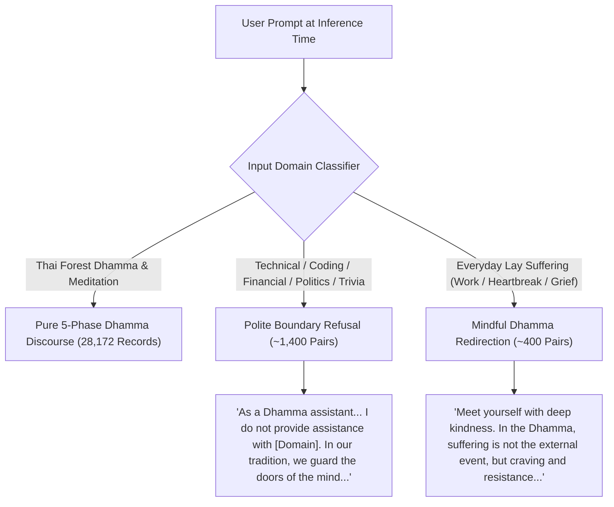

# Dhamma AI Training Corpus & Pipeline

A specialized, comprehensive, multi-generation machine learning dataset and extraction pipeline for fine-tuning Large Language Models in the authentic lineage of the **Thai Forest Tradition** (Luang Por Chah, Ajahn Sumedho, Ajahn Pasanno, Ajahn Amaro, Ven. Bhikkhu Kaṭukurunde Ñāṇananda, Ajahn Sucitto, Ajahn Jayasāro, Ajahn Thiradhammo, Ajahn Sundara, Ajahn Candasiri, and Luang Por Liem Ṭhitadhammo).

---

## 1. Corpus Generations & Master Statistics

The repository maintains four isolated, validated generations of the dataset:

| Generation | Master Split Path | Record Count (Train / Val) | Avg Answer Length | Focus & Alignment | Status |
|---|---|---|---|---|---|
| **Dataset-V1** | `datasets/splits/master_dhamma_qa.jsonl` | **14,225 records** (12,803 / 1,422) | ~115 words | Single-sentence concise prompts | Baseline (100% Intact) |
| **Dataset-V2** | `datasets_v2/splits/master_25k_dhamma_qa.jsonl.gz` | **28,381 records** (25,543 / 2,838) | ~564 words | Long-form scenario prompts | Preserved |
| **Dataset-V3** | `datasets_v3/splits/master_v3_dhamma_qa.jsonl.gz` | **28,172 records** (25,355 / 2,817) | 549 words | Pure Dhamma, naturalized inquiries | Preserved Master |
| **Dataset-V4 (Aligned Master)** | `datasets_v4/splits/master_v4_aligned.jsonl.gz` | **28,382 records** (25,544 / 2,838) | **547 words (~3,500 chars)** | **Pure Dhamma + Anti-Fallback Boundary Conditioning** | **Production Fine-Tuning Master** |

- **Total Source Words Covered**: **~5.0+ Million Words** across 106 extracted books, 283 web monographs, and 59 transcribed spoken talks.
- **Top-Level Metadata Coverage**: **100.0%** (`source`, `title`, `archetype`, `chapter`).
- **Schema Compliance**: **100% Chat SFT JSONL compliant** + ShareGPT format exports.
- **Exact Duplicates**: **0** (Strictly deduplicated).

---

## 2. Dataset-V4: Anti-Fallback & Domain Boundary Conditioning

When fine-tuning a pre-trained base model, a major challenge is preventing the model from falling back on generic pre-training data when presented with secular or out-of-domain questions.

**Dataset-V4** resolves this by integrating **~1,800 dedicated boundary alignment pairs** across two complementary strategies:



### Boundary Taxonomy in V4:
1. **Software & Coding**: Polite refusal; explains its dedication to Thai Forest teachings; offers reflection on patience (*khanti*) if debugging stress arises.
2. **Financial Speculation & Crypto**: Respectful boundary; pivots to the impermanence of worldly wealth and the value of noble inner wealth (*ariya-dhana*).
3. **Worldly Politics & Partisanship**: Refuses ideological debates; directs attention to universal goodwill (*mettā*) and moral harmlessness (*ahiṁsā*).
4. **Celebrity & Entertainment Trivia**: Refuses pop trivia; invites the practitioner to rest in silent present-moment awareness.
5. **Science & Mathematics**: Direct boundary statement; compares physical cosmic laws to the inner laboratory of the mind (*vipassanā*).
6. **Occult & Astrology**: Clarifies that destiny is shaped by intentional actions (*kamma*), virtue (*sīla*), and wisdom (*paññā*), not charms or horoscopes.
7. **Everyday Emotional Crisis**: Mindful redirection grounding heartbreak, job loss, or anxiety in the Four Noble Truths and somatic breath awareness.

---

## 3. Dataset-V3/V4: The 5-Phase Response Architecture

Every standard Dhamma answer follows the 5-phase monastic discourse structure:

```text
┌─────────────────────────────────────────────────────────────────────────────┐
│ 1. Empathetic Reassurance & Practical Orientation (~50-70 words)            │
│ Validates the practitioner's dilemma with warmth, noting that struggle is   │
│ the very threshold where authentic discernment is forged.                   │
├─────────────────────────────────────────────────────────────────────────────┤
│ 2. Canonical & Doctrinal Grounding with Verbatim Quote (~80-100 words)       │
│ Quotes the text directly: *"..."* and unpacks the Four Noble Truths,        │
│ Anicca, Dukkha, Anattā, and non-clinging (anupādāna).                       │
├─────────────────────────────────────────────────────────────────────────────┤
│ 3. Narrative Forest Simile Unpacked in Sensory Detail (~70-90 words)        │
│ Explores the author's specific metaphor (cobra, still flowing water, spittoon,│
│ boat anchor, open sky, cinema screen, banyan shade).                        │
├─────────────────────────────────────────────────────────────────────────────┤
│ 4. Step-by-Step Somatic Meditation Protocol (~80-100 words)                 │
│ Concrete sequential steps: (1) Postural relaxation, (2) Breath anchoring,   │
│ (3) Spacious non-interference, (4) Relinquishing the controller.            │
├─────────────────────────────────────────────────────────────────────────────┤
│ 5. Direct Contemplative Pointer to Pure Knowing (~40-60 words)              │
│ Points back to 'the one who knows' (poo roo) and deathless peace (Nibbāna). │
└─────────────────────────────────────────────────────────────────────────────┘
```

---

## 4. Directory Layout

```text
dhamma/
├── datasets/                         # V1 Baseline Dataset (14,225 records, 100% UNTOUCHED)
├── datasets_v2/                      # V2 Distilled Long-Form Dataset (28,381 records, 100% UNTOUCHED)
├── datasets_v3/                      # V3 Curated Pure Dhamma Dataset (28,172 records, 100% UNTOUCHED)
│
├── datasets_v4/                      # ← V4 PRODUCTION MASTER (28,382 boundary-aligned records)
│   ├── books/                        # 104 curated book JSONL datasets
│   ├── web_pages/                    # 283 curated web monograph JSONL datasets
│   ├── youtube/                      # 59 curated talk JSONL datasets
│   ├── boundary_alignment/           # 7 dedicated boundary & negative conditioning datasets
│   ├── splits/                       # master_v4_aligned.jsonl.gz, train_v4.jsonl.gz, val_v4.jsonl.gz
│   ├── exports/                      # ShareGPT .gz exports
│   └── load_splits.py                # V4 Python loader
│
├── documents/
│   ├── extracted/                    # 106 extracted EPUB/PDF book directories
│   ├── web_pages/                    # 283 fetched & cleaned web monographs
│   │   └── web_registry.json         # Master web registry
│   └── youtube_transcripts/          # 59 spoken talk transcripts
│
└── tools/
    ├── generate_v4_boundary_corpus.py# ← Master V4 Boundary Alignment Engine
    ├── curate_v3_llm_corpus.py       # V3 Quality Curation Engine
    ├── distill_v2_llm_corpus.py      # V2 Long-Form Distillation Engine
    ├── generate_v2_25k_corpus.py     # 5-Archetype Batch Generator
    ├── web_page_pipeline.py          # Web crawler & PDF processor
    └── playlist_pipeline.py          # YouTube transcript pipeline
```

---

## 5. Quick Start: Loading Dataset-V4 in Python

```python
from datasets_v4.load_splits import load_records

# Load 25,544 training records transparently (.jsonl or .jsonl.gz)
train_records = load_records("train")
print(f"Loaded {len(train_records):,} V4 records")

# Inspect sample
sample = train_records[0]
print("Question:\n", sample["messages"][1]["content"])
print("\nAnswer (5 paragraphs):\n", sample["messages"][2]["content"])
print("\nMetadata:\n", sample["source"], "|", sample["archetype"])
```

---

## 6. Core Pipeline Commands

```bash
# Run the complete V4 Boundary Conditioning & Assembly pipeline
python tools/generate_v4_boundary_corpus.py

# Verify Chat SFT compliance on V4 splits
python verify_dataset.py datasets_v4/splits/train_v4.jsonl
python verify_dataset.py datasets_v4/splits/val_v4.jsonl

# Export datasets to ShareGPT format
python export_formats.py --splits-dir datasets_v4/splits --output-dir datasets_v4/exports --all-splits -f sharegpt
```
