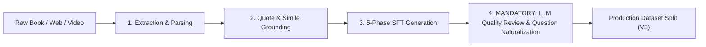

# Dhamma AI Training Corpus & Pipeline

A specialized, comprehensive, multi-generation machine learning dataset and extraction pipeline for fine-tuning Large Language Models in the authentic lineage of the **Thai Forest Tradition** (Luang Por Chah, Ajahn Sumedho, Ajahn Pasanno, Ajahn Amaro, Ven. Bhikkhu Kaṭukurunde Ñāṇananda, Ajahn Sucitto, Ajahn Jayasāro, Ajahn Thiradhammo, Ajahn Sundara, Ajahn Candasiri, and Luang Por Liem Ṭhitadhammo).

---

## 1. Corpus Generations & Master Statistics

The repository maintains three clean, isolated generations of the dataset:

| Generation | Master Split Path | Record Count (Train / Val) | Avg Answer Length | Question Style | Status |
|---|---|---|---|---|---|
| **Dataset-V1** | `datasets/splits/master_dhamma_qa.jsonl` | **14,225 records** (12,803 / 1,422) | ~115 words | Single-sentence concise prompts | Baseline (100% Intact) |
| **Dataset-V2** | `datasets_v2/splits/master_25k_dhamma_qa.jsonl.gz` | **28,381 records** (25,543 / 2,838) | ~564 words | Long-form scenario prompts | Preserved |
| **Dataset-V3 (Master)** | `datasets_v3/splits/master_v3_dhamma_qa.jsonl.gz` | **28,172 records** (25,355 / 2,817) | **549 words (~3,500 chars)** | **Naturalized Living Inquiries** | **Production Master** |

- **Total Source Words Covered**: **~5.0+ Million Words** across 106 extracted books, 283 web monographs, and 59 transcribed spoken talks.
- **Top-Level Metadata Coverage**: **100.0%** (`source`, `title`, `archetype`, `chapter`).
- **Schema Compliance**: **100% Chat SFT JSONL compliant** + ShareGPT format exports.
- **Exact Duplicates**: **0** (Strictly deduplicated).

---

## 2. Dataset-V3: The 5-Phase Response Architecture

Every assistant answer in Dataset-V3 is structured into five distinct, compassionate paragraphs:

```text
┌─────────────────────────────────────────────────────────────────────────────┐
│ 1. Empathetic Reassurance & Practical Orientation (~50-70 words)            │
│ Validates the practitioner's dilemma with warmth, noting that struggle is   │
│ the very threshold where authentic discernment is forged.                   │
├─────────────────────────────────────────────────────────────────────────────┤
│ 2. Canonical & Doctrinal Grounding with Verbatim Quote (~80-100 words)       │
│ Quotes the text directly: *"..."* and unpacks the Four Noble Truths,        │
│ Anicca, Dukkha, Anattā, and non-clinging (anupādāna).                       │
├─────────────────────────────────────────────────────────────────────────────┤
│ 3. Narrative Forest Simile Unpacked in Sensory Detail (~70-90 words)        │
│ Explores the author's specific metaphor (cobra, still flowing water, spittoon,│
│ boat anchor, open sky, cinema screen, banyan shade).                        │
├─────────────────────────────────────────────────────────────────────────────┤
│ 4. Step-by-Step Somatic Meditation Protocol (~80-100 words)                 │
│ Concrete sequential steps: (1) Postural relaxation, (2) Breath anchoring,   │
│ (3) Spacious non-interference, (4) Relinquishing the controller.            │
├─────────────────────────────────────────────────────────────────────────────┤
│ 5. Direct Contemplative Pointer to Pure Knowing (~40-60 words)              │
│ Points back to 'the one who knows' (poo roo) and deathless peace (Nibbāna). │
└─────────────────────────────────────────────────────────────────────────────┘
```

---

## 3. Mandatory Ingestion Standard: Final Phase LLM Review

To maintain the quality benchmark established in V3, **all future text ingestion pipelines must incorporate the Final Phase LLM Curation Review**:



### Quality Directives for the Final Review Phase:
1. **Question Naturalization**: Strip out formulaic book-title injections (e.g. *"In Book X Chapter Y..."*). Frame questions as natural, living inquiries from a practitioner facing a meditation threshold or life challenge.
2. **Metadata Separation**: Book and chapter titles must reside strictly in top-level JSON metadata (`"source"`, `"title"`, `"chapter"`).
3. **Seamless Quote Weaving**: Ensure verbatim quotes are embedded smoothly into the syntax of the master's discourse.
4. **Anti-Tinkering Strictness**: Forbid introducing external theological doctrines or speculative interpretations absent from the source chapter.

---

## 4. Directory Layout

```text
dhamma/
├── datasets/                         # V1 Baseline Dataset (14,225 records, 100% UNTOUCHED)
│   ├── splits/                       # master_dhamma_qa, train, val
│   └── exports/                      # ShareGPT exports
│
├── datasets_v2/                      # V2 Distilled Long-Form Dataset (28,381 records)
│   ├── splits/                       # master_25k_dhamma_qa.jsonl.gz, train_25k.jsonl.gz, val_25k.jsonl.gz
│   ├── exports/                      # ShareGPT .gz exports
│   └── load_splits.py                # V2 Python loader
│
├── datasets_v3/                      # ← V3 PRODUCTION MASTER (28,172 perfected records)
│   ├── books/                        # 104 curated book JSONL datasets
│   ├── web_pages/                    # 283 curated web monograph JSONL datasets
│   ├── youtube/                      # 59 curated talk JSONL datasets
│   ├── splits/                       # master_v3_dhamma_qa.jsonl.gz, train_v3.jsonl.gz, val_v3.jsonl.gz
│   ├── exports/                      # ShareGPT .gz exports
│   └── load_splits.py                # V3 Python loader
│
├── documents/
│   ├── extracted/                    # 106 extracted EPUB/PDF book directories
│   ├── web_pages/                    # 283 fetched & cleaned web monographs
│   │   └── web_registry.json         # Master web registry
│   └── youtube_transcripts/          # 59 spoken talk transcripts
│
└── tools/
    ├── curate_v3_llm_corpus.py       # ← Master V3 Quality Curation Engine
    ├── distill_v2_llm_corpus.py      # V2 Long-Form Distillation Engine
    ├── generate_v2_25k_corpus.py     # 5-Archetype Batch Generator
    ├── web_page_pipeline.py          # Web crawler & PDF processor
    └── playlist_pipeline.py          # YouTube transcript pipeline
```

---

## 5. Quick Start: Loading Dataset-V3 in Python

```python
from datasets_v3.load_splits import load_records

# Load 25,355 training records transparently (.jsonl or .jsonl.gz)
train_records = load_records("train")
print(f"Loaded {len(train_records):,} V3 records")

# Inspect sample
sample = train_records[0]
print("Question:\n", sample["messages"][1]["content"])
print("\nAnswer (5 paragraphs):\n", sample["messages"][2]["content"])
print("\nMetadata:\n", sample["source"], "|", sample["archetype"])
```

---

## 6. Core Pipeline Commands

```bash
# Run the complete V3 LLM Curation Review pipeline across all sources
python tools/curate_v3_llm_corpus.py

# Verify Chat SFT compliance and word count statistics on V3 splits
python verify_dataset.py datasets_v3/splits/train_v3.jsonl
python verify_dataset.py datasets_v3/splits/val_v3.jsonl

# Process new web pages or online monographs
python tools/web_page_pipeline.py --book https://www.dhammatalks.org/books/HeartReleased/

# Export datasets to ShareGPT format
python export_formats.py --splits-dir datasets_v3/splits --output-dir datasets_v3/exports --all-splits -f sharegpt
```
